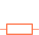
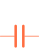
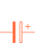
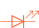
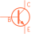

# O co jde?

Electron je... (zde @Martin něco napíše)

## Schématické značky

|	Název		            |			Značka			|
| -------------             | ------------------------- |
|Baterie		            ||
|Rezistor		            ||
|Kondenzátor	            ||
|Kondenzátor polarizovaný   ||
|LED    		            ||
|Tlačítko		            ||
|Přepínač		            ||
|Potenciometr	            ||
|Tranzistor NPN             ||
|Tranzistor PNP             ||

## Správné zapojování kabelů k součástkám

