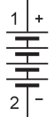
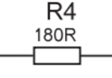
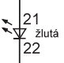
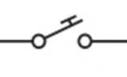
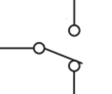
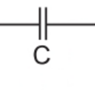
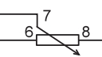
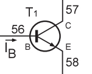
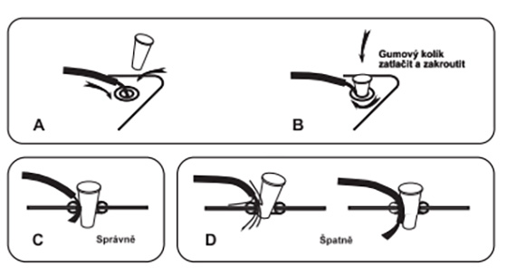

# Electron

## Úvod

### Schématické značky

| Značka					|Značka|
| ------------------------- | -------- |
||Baterka|
||Odpor|
||LED dioda|
||Tlačítko|
||Přepínač|
||Kondenzátor|
||Potenciometr|
||Tranzistor|

## Správné zapojování kabelů k součástkám

### [Další lekce](electron-lesson-1.md)

