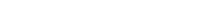

# Lekce 1

## 1. Tlačítko, odpor a LED dioda

Obvod obsahuje zdroj elektrického napětí, spotřebič – LED dioda, odpor, který omezuje proud procházející diodou, spínací tlačítko a spojovací vodiče. 
Spojte na panelu zdířky dle schématu. 

Po zmáčknutí tlačítka se rozsvítí LED dioda. Stiskem tlačítka se spojí jeho kontakty a uzavře se elektrický obvod. Elektrický proud teče po dobu stisku tlačítka od plus (+) pólu baterie přes propojené součástky k minus (-) pólu baterie. Dioda je zapojena v propustném směru neboli propouští proud a ten ji rozsvěcuje. Po uvolnění tlačítka se elektrický obvod přeruší, proud přestane procházet a LED dioda zhasne. 

Nyní zkuste připojit LED diodu obráceně (prohoďte vzájemně konce vodičů upevněné ve zdířkách). Dioda je nyní zapojena v závěrném směru, nepropouští proud, a tedy po zmáčknutí tlačítka nesvítí. 

Ověřili jste si tak základní vlastnost polovodičové diody – propouští proud jen v jednom směru. Tímto jednoduchým zapojením si můžete vždy, když máte pochybnosti, ověřit, jestli jsou jednotlivé diody v pořádku.

Můžete rozsvítit červenou, žlutou nebo zelenou diodu. 

POZOR! Je nutné, aby v obvodu s LED diodou byl vždy zařazen omezovací odpor. Pokud byste připojili LED diodu v propustném směru přímo na zdroj napětí – baterii, zcela jistě byste LED diodu zničili.

### Měřené hodnoty

**Napětí** na diodě je nižší než na vstupu. Je to způsobeno odporem, který snižuje protékající proud a napětí. Napětí na LED diodě by mělo být zhruba **2V**. 
**Proud** procházející LED diodou je přibližně **16mA**, což stačí na to, aby se LED dioda rozsvítila. 

## 2. Sériové zapojení odporů

Vlastnosti sériového spojení odporů si můžete ověřit na modelu dle schématu. Po zapojení se rozsvítí a. Pokud přepínač v poloze nahoře, proud musí procházet oběma odpory, z nichž každý svým dílem zmenšuje celkový proud v obvodu a LED dioda svítí slaběji. Pokud přepnete přepínač do spodní polohy, proud nemusí protékat přes odpor 560Ω a protéká pouze odporem 180Ω, proto je proud větší a LED dioda svítí silněji. V tomto schématu jsou zařazeny v sérii dva odpory, ale je možno takhle za sebou propojit odporů více. Výsledný odpor R sériové kombinace odporů se rovná součtu hodnot jednotlivých odporů, v našem případě R = R6 + R4. R = 560 + 180 = 740Ω

### Měřené hodnoty

**Napětí** na LED diodě, při pozici přepínače v poloze dole, by mělo být zhruba **2V**, v poloze na hoře je to o něco méně **1,9V**. 

**Proud** procházející LED diodou při pozici přepínače v poloze dole, je stejný jako v prvním příkladě tedy **16mA**, v poloze na hoře  je to o dost méně skoro **4,3mA**, což stále stačí na to, aby se LED dioda rozsvítila.

## 3. Paralelní zapojení odporů

Na tomto zapojení si můžete vyzkoušet, jaké vlastnosti bude mít zapojení odporů paralelně (souběžně) neboli vedle sebe. Zapojte obvod podle schématu. Rozsvítí se LED dioda a po stisku tlačítka se rozsvítí silněji. Vysvětlení je následující: pokud je tlačítko rozepnuto, proud prochází přes odpor 560Ω a rozsvěcuje LED diodu poněkud slaběji. Po stisknutí tlačítka začne proud procházet oběma odpory současně a je proto větší. To se projeví zvětšením jasu LED diody.

Pro snadnější pochopení principu si představte situaci, kdy jedněmi dveřmi proudí do kina zástup lidí. V okamžiku, kdy se otevřou druhé dveře, začnou vcházet lidé i těmito dveřmi a kino se začne plnit rychleji.

Vraťme se k našemu schématu. V sériovém zapojení podle návodu č.2 byl výsledný odpor větší než odpor kteréhokoli použitého odporu. Paralelně můžeme spojit dva i vice odporů. Výsledný odpor je vždy menší než hodnota nejmenšího z odporů zapojených paralelně. Přesně se výsledný odpor R v našem schématu vypočte podle vztahu:

### [Další lekce](electron-lesson-2.md)