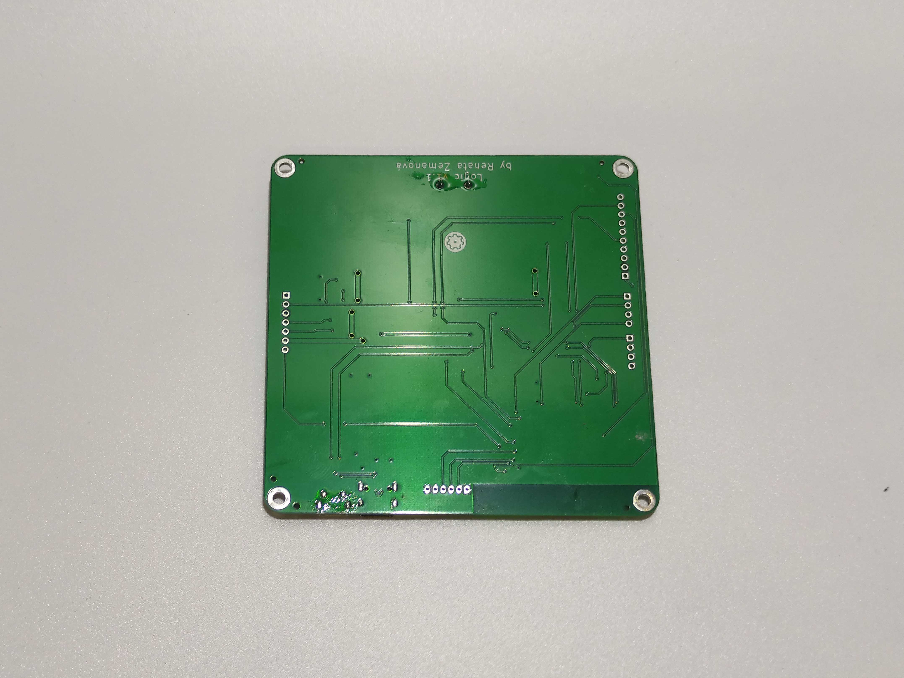
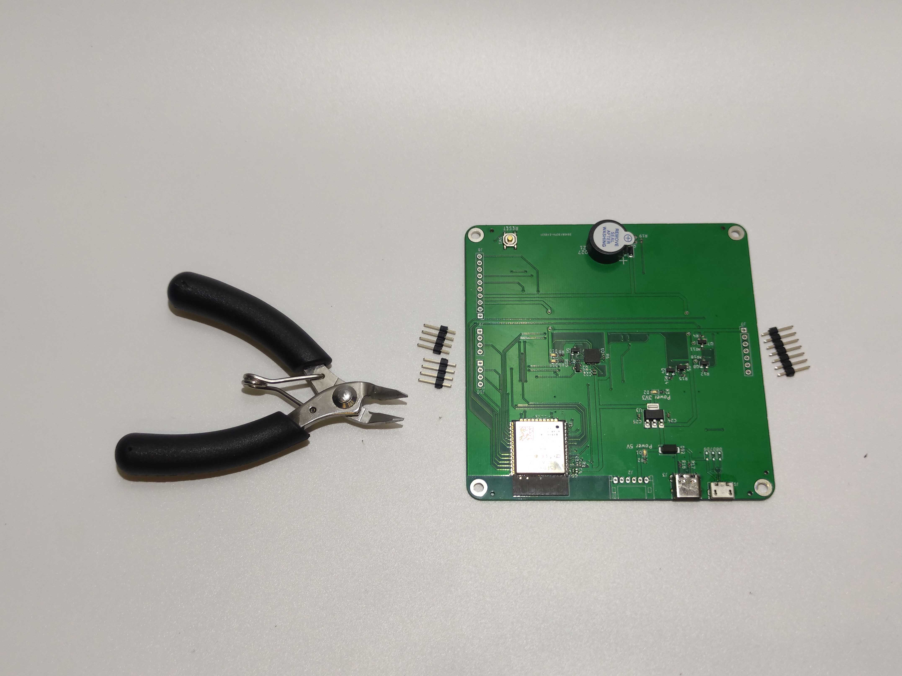
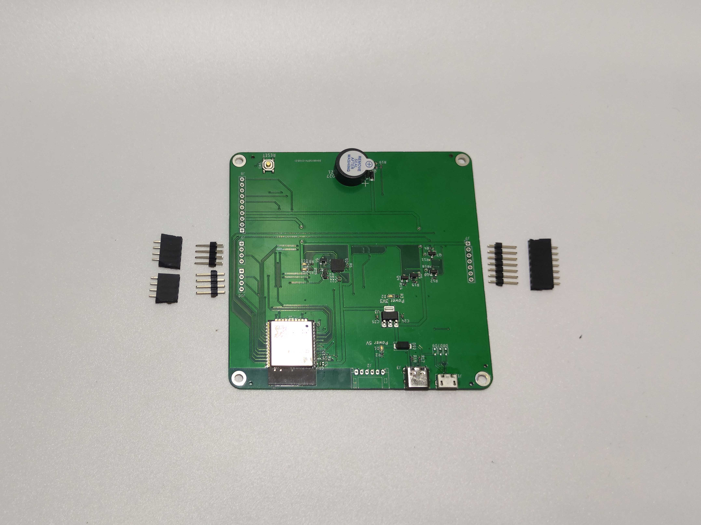

# Logic

## Návod na složení

 
1. Připravíme si potřebný materiál podle fotky

 
2. 

 
3. 

 
4. 

 
5. 

 
6. 

 
7. 

 
8. 

 
9. 

 
10. 

 
11. 

 
12. 

 
13. 

 
14. 

 
15. 

 
16. 

 
17. 

 
18. 

 
19. 

 
20. 

 
21. 

 
22. 

 
23. 

 
24. 

 
25. 

 
26. 

 
27. 

 
28. 

 
29. 

 
30. 

 
31. 

 
32. 

