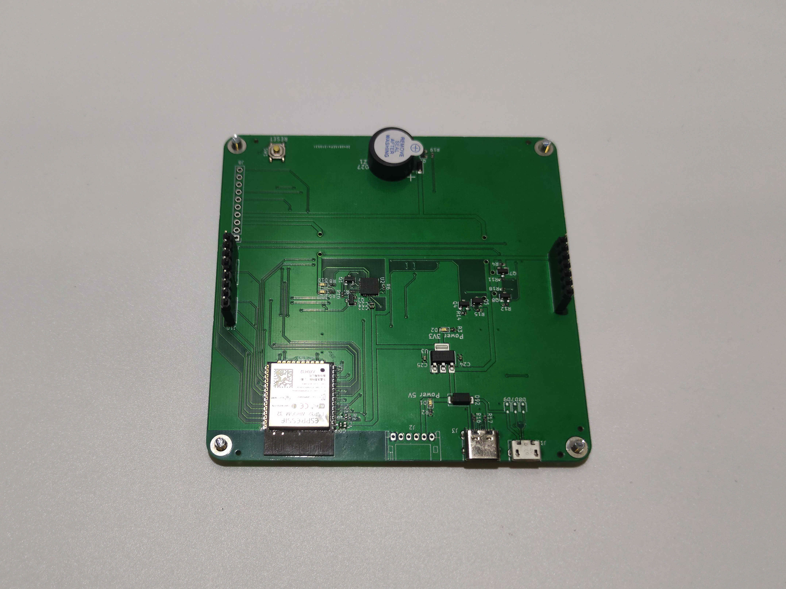
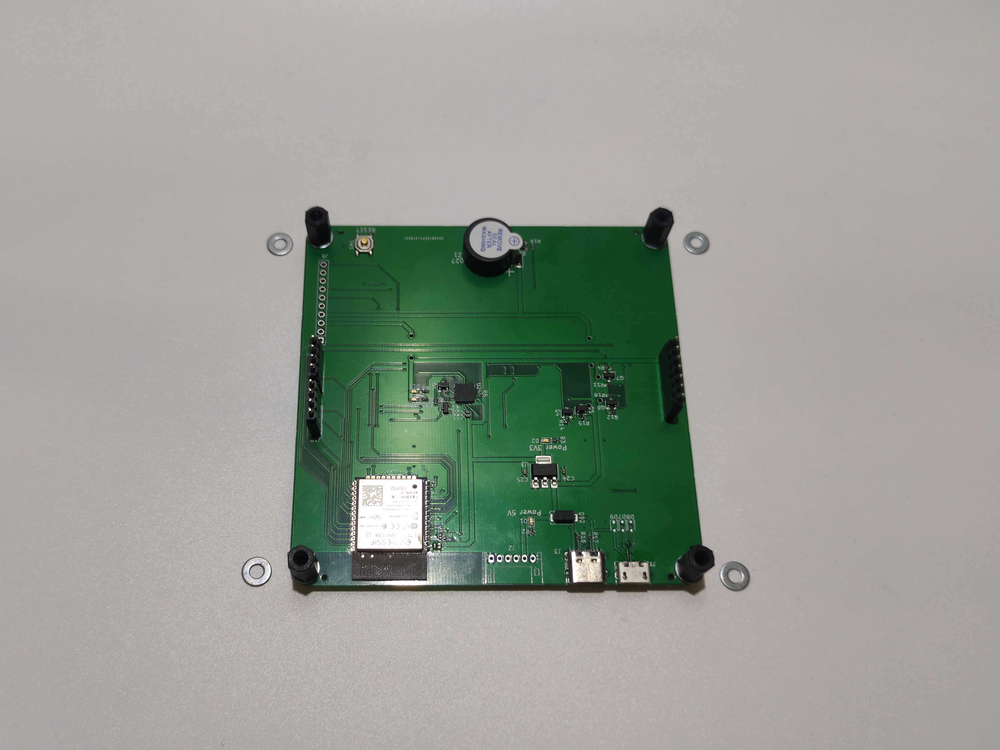
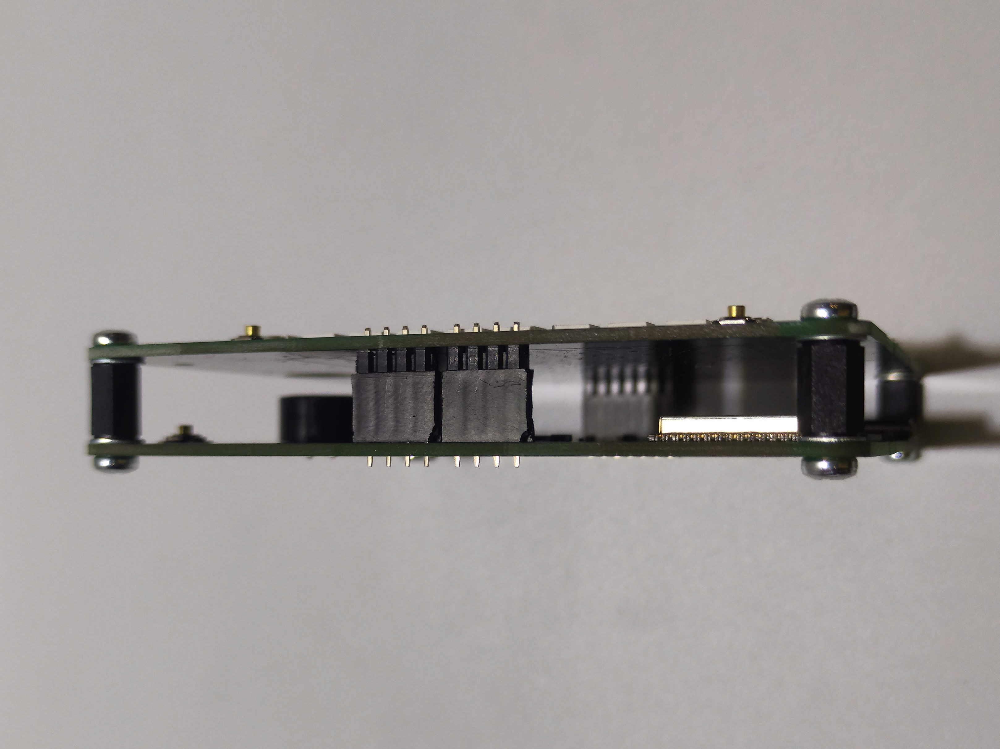
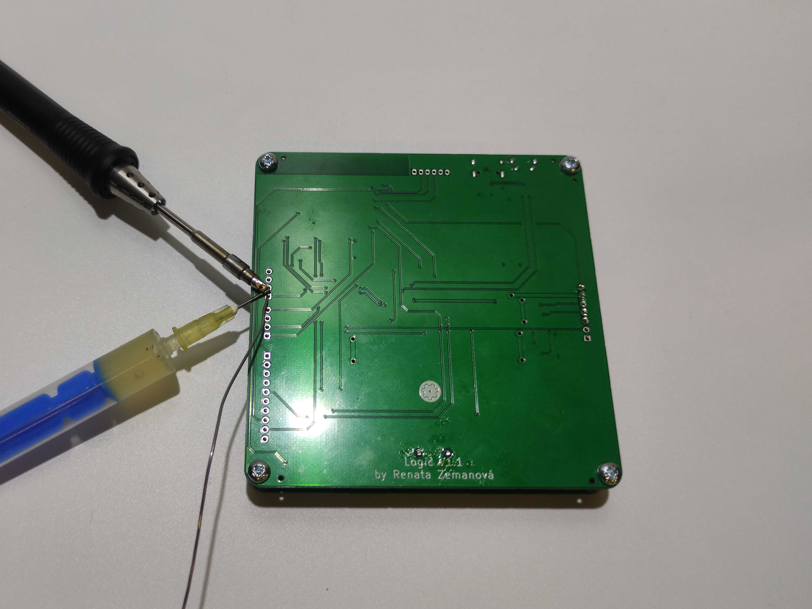

# Logic

## Návod na složení

 
1. Připravíme si potřebný materiál podle fotky

 
2. Vložíme piezo do desky podle obrázku (pozor na otočení součástky)

 
1. Připájíme piezo k desce

 
1. Pomocí štípacích kleští zastřihneme přečnívající nožičky

 
1. Ustřihneme si dutinky a pinheady podle zadání.
	- 2x pinhead a dutinky o délce 4 piny
	- 1x pinhead a dutinky o délce 7 pinů 

 
1.  Pomocí zalamovacího nože si opatrně začistíme okraje

 
11. Začištěné dílky

<!--  
12. 

 -->

 
13. Pinheady zastrčíme do dutinek

 
14. Zastrčíme dílky do desky dutinkami napřed. Nachystáme si 4 šroubky

<!--  
15. 

 -->

 
16. Vložíme šroubky do desky a nachystáme si podložky

 
17. Vložíme na desky nachystané podložky

<!--  
18. 

 -->

 
19.  Nachystáme si 4 distanční sloupky a našroubujeme na desku

 
20. Nachystáme si podložky

<!--  
21. 

 -->

 
22. Podložky položíme na distanční sloupky a připravíme si další desku

 
1.  Desky nasadíme na sebe tak, aby nám seděly díry a pinheady

 
24. Připravíme se 4 šroubky

 
25. Přišroubujeme vrchní desku (pozor na podložky)

<!--  
26. 

 -->

 
27. Zapájíme pinheady na horní straně Logicu

<!--  
28. 

 -->

<!--  
29. 

 -->

 
30. Zapájíme dutinky na spodní straně Logicu

 
31. Hotový logic zepředu

 
32. Hotový logic zezadu

