# RoboSvit

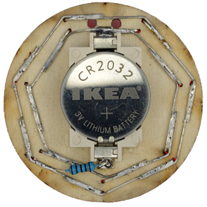

RoboSvit je malé světýlko napájené na hodinkovou
baterku. Skládá se ze sedmi LEDek a jednoho re-
zistoru. Průměr kolečka činí 45 mm a je vyřezané na
laseru z 3 mm překližky. Na přední straně světýlka je
vygravírované logo Robotárny. Dvě dírky na horní
straně jsou připravené na protáhnutí provázku, aby
bylo možné jej nosit pověšený na krku. Odběr celého
světýlka činí 2.3 mA a průměrná doba svícení je
85 hodin.

Baterie CR2032
- Napětí: 3 V
- Kapacita: 200 mAh

LED
- Napětí: 2.0 V
- Proud: 20 mA

Rezistor
- Odpor: 100 Ω
- Příkon: 0.6 W
- Tolerance: 1 %
- Řada: E24

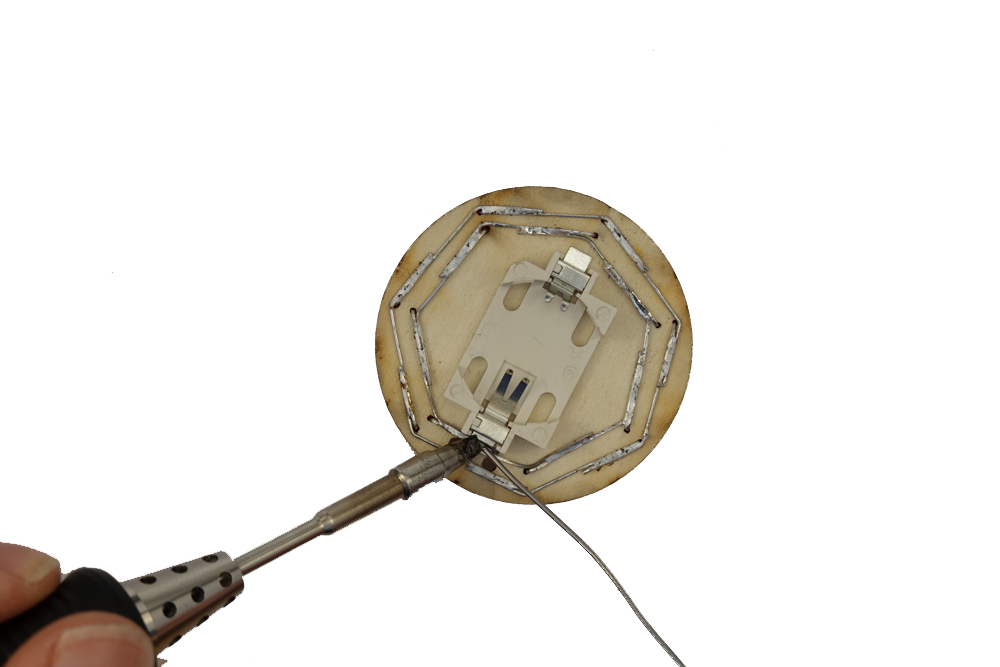

## Potřebný materiál
- Dřevěný dílek
- 7 LED
- 1 rezistor
- Držák baterie
- Baterie CR2032

## Návod na složení
 
1. Připravíme si potřebný materiál

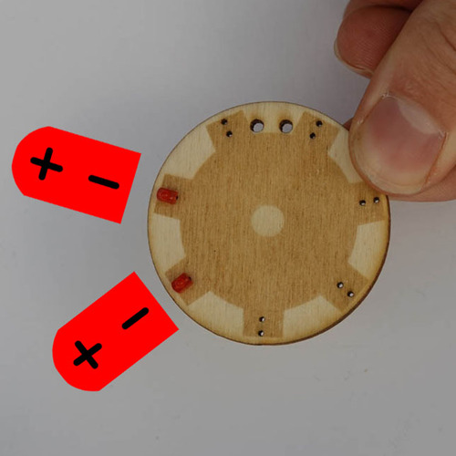 
2. Vložíme 2 LEDky podle znázornění na obrázku

 
3. LEDku dotlačíme k překližce

 
4. Ohneme vnější nožičku LEDky podle šipky

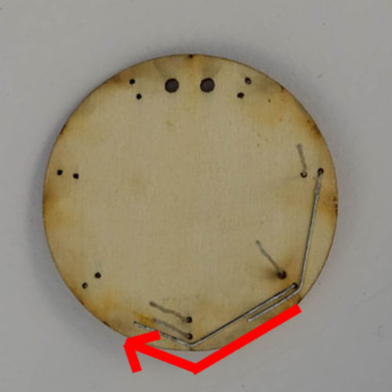 
5. Vložíme a ohneme další nožičku LEDky

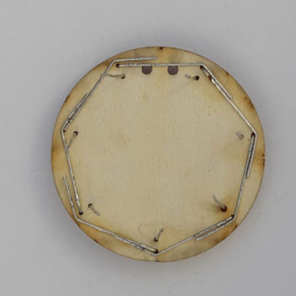 
6. Proces opakujeme celkem sedmkrát

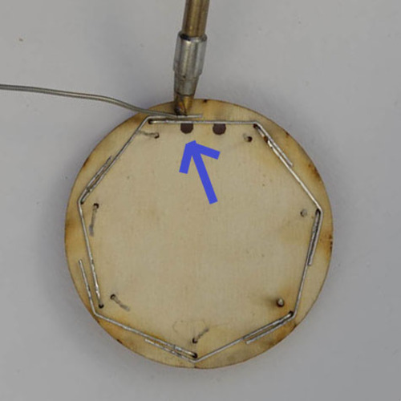 
7. Vnější kružnici zapájíme dohromady

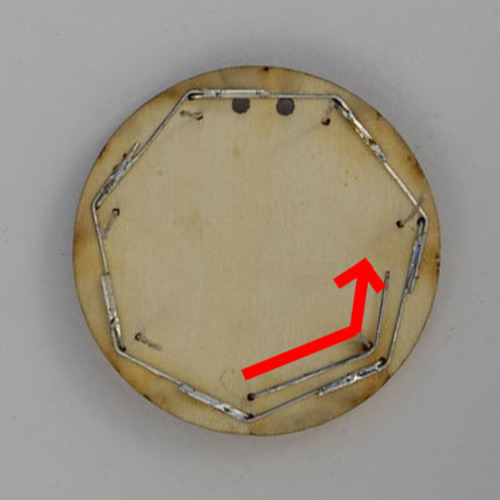 
8. Ohneme vnitřní nožičku LEDky podle šipky

 
9. Pokračujeme v ohýbání LEDek

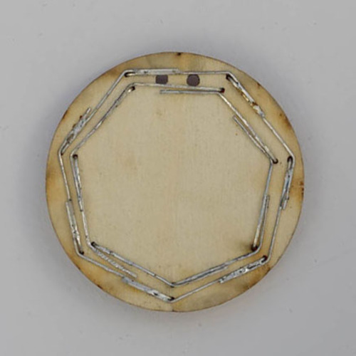 
10. Postupně zohneme všechny nožičky LEDek

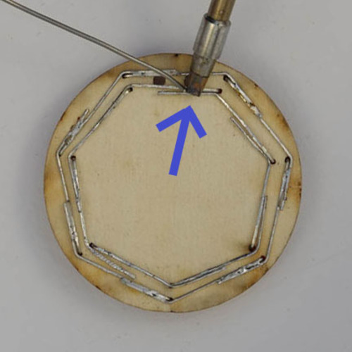 
11. Zapájíme vnitřní kružnici

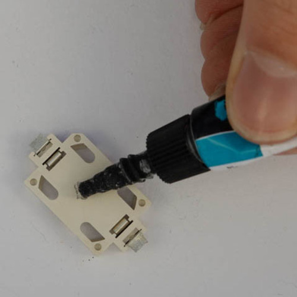 
12. Na držák naneseme kapku lepidla

 
13. Držák přitiskneme pod drátky (**pozor polarita!**)

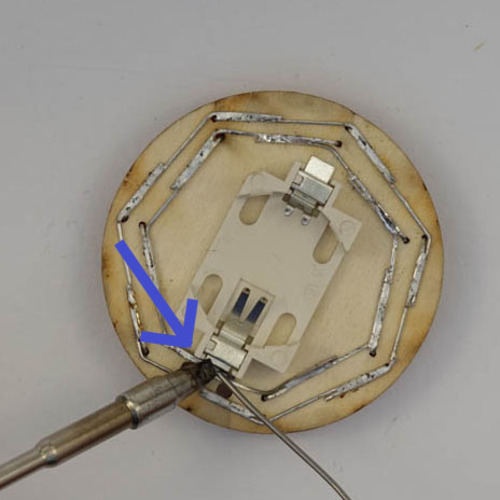 
14. Připájíme držák k LEDkám

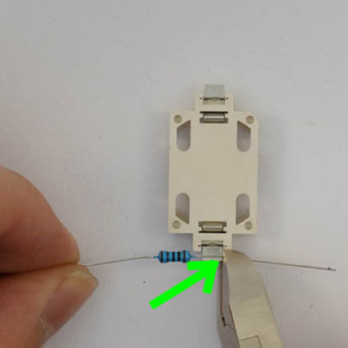 
15. Zakrátíme nožičku rezistoru podle šipky

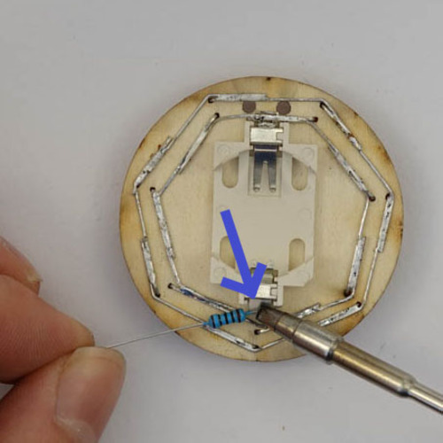 
16. Připájíme rezistor k držáku baterií

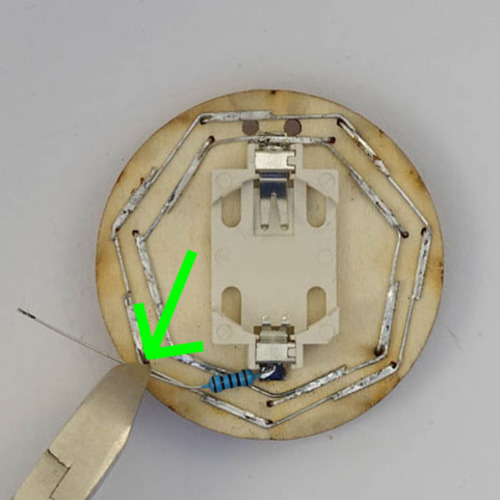 
17. Zakrátíme nožičku rezistoru podle šipky

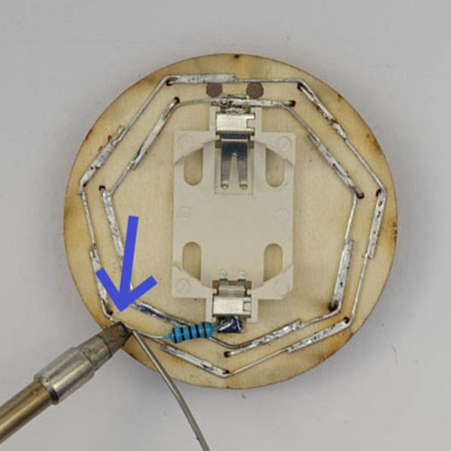 
18. Připájíme rezistor ke vnější kružnici

 
18. Vložíme baterku

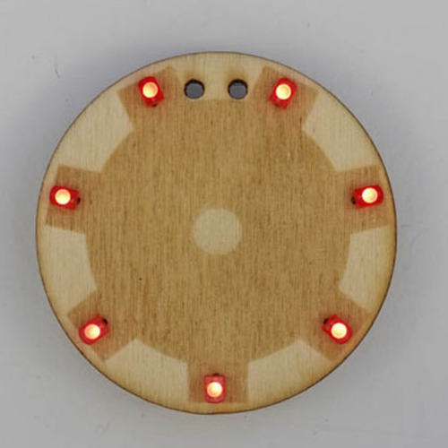 
20. Dokončený RoboSvit

Vytvořil Jakub Andrýsek.