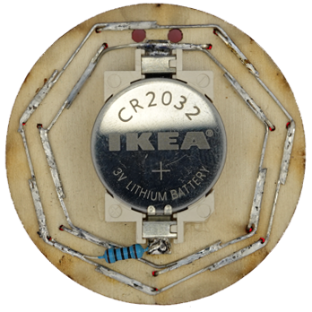
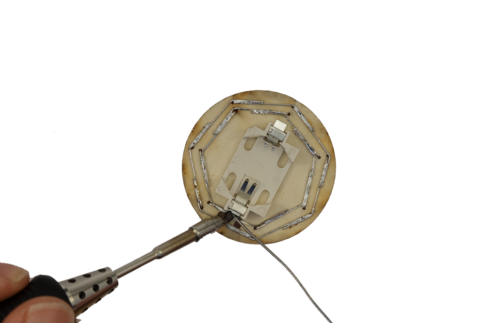

# RoboSvit

RoboSvit is a small lamp powered by watch batteries

Battery CR2032
- Voltage: 3 V
- Capacity: 200 mAh

LED
- Voltage: 2.0 V
- Current: 20 mA

Resistor
- Resistance: 100 Ω
- Power consumption: 0.6 W
- Tolerance: 1%
- Series: E24

Created by Jakub Andrýsek.