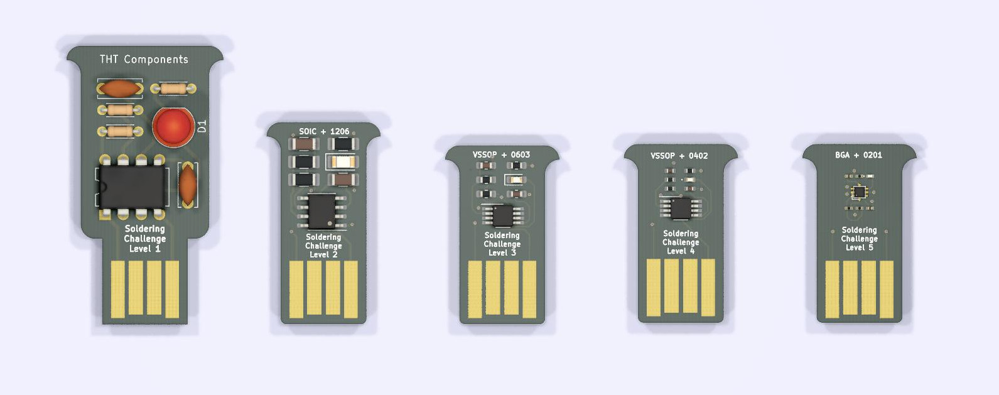

# Soldering challenge

A series of simple 555-based LED flashers that gradually shrinks the packages.
Power it by plugging it into an USB port and test your soldering skills!

- [Návod (CZ)](manual-cs.md)
- [Manual (EN)](manual-en.md)
